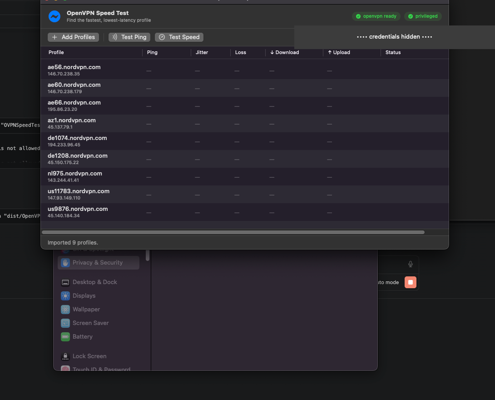

# OpenVPN Speed Test

A fast, native macOS app for finding the **best OpenVPN profile** out of many. Import your
`.ovpn` files (e.g. NordVPN server configs), then measure **real latency, jitter, packet loss,
and real download/upload speed** — and instantly see which server is best.

Built with SwiftUI. Universal binary — runs natively on both **Apple Silicon** and **Intel** Macs.



---

## Why

VPN apps rarely tell you which server is actually *best* for your connection. The closest one by
country isn't always the lowest-latency or fastest. This tool tests them empirically:

- **Latency & jitter** are measured by timing real TCP handshakes to the server, in parallel —
  hundreds of profiles in seconds. (VPN nodes rate-limit/drop ICMP, so a plain `ping` reports
  fake packet loss; a TCP `SYN → SYN-ACK` is one clean round-trip that the server always answers.)
- **Download & upload** are measured by actually connecting through the OpenVPN tunnel and running
  a real transfer against [Cloudflare](https://speed.cloudflare.com).

The two are **separate modules**: ping/jitter is instant and needs no privileges; the speed test
connects for real and needs `openvpn`.

## Features

- 📂 **Built-in profile library** — import `.ovpn` files into the app; they're copied into the
  app's own storage. No external folders to manage.
- ⚡ **Ping + jitter + loss**, measured in parallel, sorted fastest-first.
- 📊 **Real download/upload** through the tunnel, via Cloudflare.
- 🔑 **Username/password fields** for profiles that use `auth-user-pass` (saved locally, never in
  the bundle or git).
- 🏆 Automatic ranking and "best profile" highlight.
- 🖥️ Native SwiftUI, universal (arm64 + x86_64).

## Requirements

- macOS 13 (Ventura) or later
- [`openvpn`](https://openvpn.net/) for the speed test (latency tests work without it):
  ```sh
  brew install openvpn
  ```

## Install

Download the latest `OpenVPN Speed Test.app` from the
[Releases](../../releases) page, move it to `/Applications`, and open it.

> The app is ad-hoc signed (not notarized). On first launch, right-click the app → **Open**, or
> allow it in **System Settings → Privacy & Security**.

## Build from source

```sh
git clone <your-repo-url>
cd openvpn-speed-test

# Universal .app (arm64 + x86_64) → dist/OpenVPN Speed Test.app
scripts/build-app.sh

# Or a quick single-arch dev build:
ARCHS="$(uname -m)" scripts/build-app.sh

# CLI engine (handy for testing / scripting):
swift build --product ovpn-test
.build/debug/ovpn-test ping ~/Downloads/*.ovpn
```

## How to use

1. **Add Profiles** (or drag `.ovpn` files onto the window).
2. Enter your VPN **username / password** (for NordVPN, these are your *service credentials*, not
   your account login).
3. Click **Test Ping** — every profile is measured and sorted by latency.
4. Select one or more profiles and click **Test Speed** to connect through each and measure
   download/upload.

### Privileged access (for speed tests)

`openvpn` needs root to create the tunnel device. Instead of asking for your password on every
test, the app installs a one-time `sudoers` rule (click **Setup**, enter your password once) that
lets it run *only* the `openvpn` binary and `kill` without a password. Remove it any time:

```sh
sudo rm /etc/sudoers.d/ovpn-speedtest
```

## How it works

| Module | Technique | Privileges |
|---|---|---|
| Latency / jitter | Parallel TCP-handshake RTT (port 443 for UDP profiles); retransmit outliers reclassified as loss | none |
| Speed | Connect via `openvpn`, then N parallel chunked streams to Cloudflare `__down`/`__up` with a warm-up window | root (via one-time sudoers) |
| Library | `.ovpn` files copied into `~/Library/Application Support/OVPNSpeedTest/` | none |

See [ROADMAP.md](ROADMAP.md) for planned features (e.g. per-destination ping for game servers).

## Project layout

```
Sources/
  OVPNCore/            # engine: parser, latency, speed, openvpn runner, store, privilege
  OVPNSpeedTestApp/    # SwiftUI app
  ovpn-test/           # CLI front-end for the engine
scripts/build-app.sh   # universal .app bundler
```

## Security & privacy

- Credentials are stored locally at `~/Library/Application Support/OVPNSpeedTest/credentials.json`
  (file mode `0600`) and are never committed or sent anywhere except to your VPN server.
- The sudoers rule is scoped to the `openvpn` binary and `kill` only.

## License

[MIT](LICENSE)
